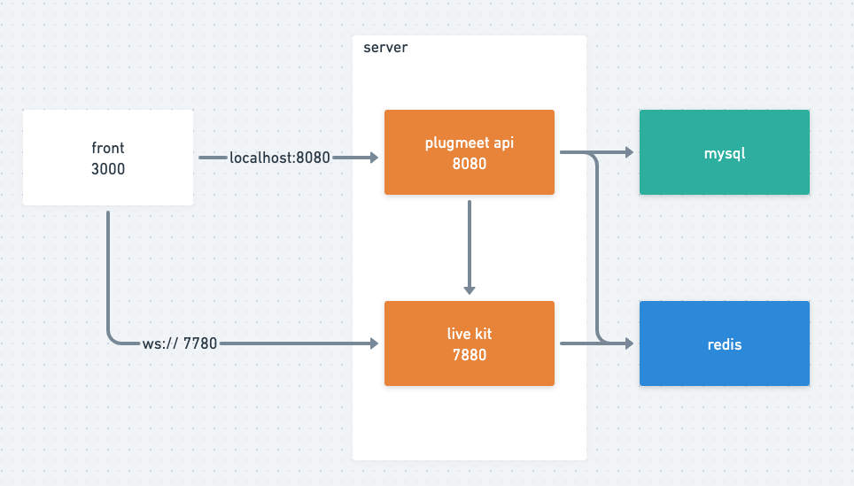

# Structure



# Create minikube cluster
```shell
minikube start -p new-project --kubernetes-version=v1.20.0
```
# Deploy all yaml file 
```shell
cd manifests
kustomize build | kubectl apply -f -   
```

# port-forward service
```shell
k port-forward svc/plugnmeet-frontent-service 3000:3000
k port-forward svc/plugnmeet-api-service 8080:8080
k port-forward svc/livekit-service 7880:7880
```

# Access front page
http://localhost:3000/login.html

# Input key and secret
```shell
api_key: "plugnmeet"
secret: "zumyyYWqv7KR2kUqvYdq4z4sXg7XTBD2ljT6"
```
